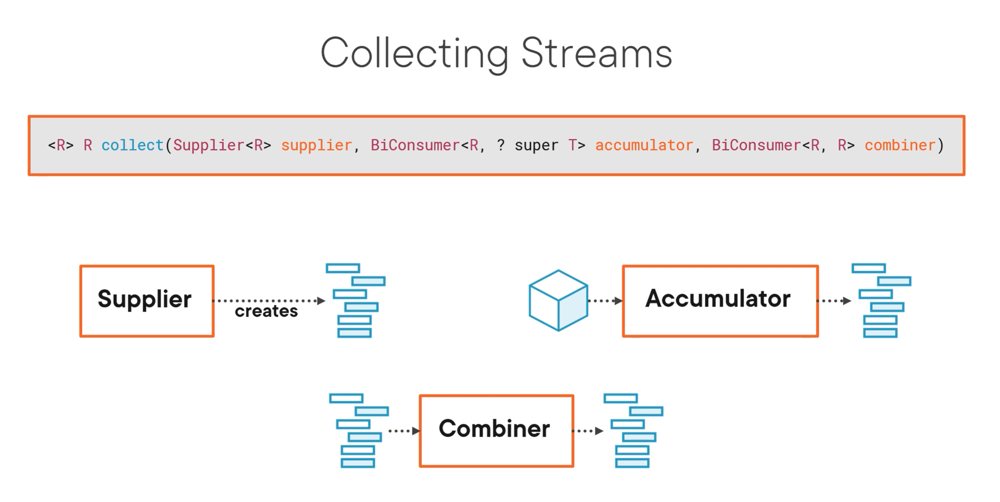

### Streams

- Once a stream is terminated it cannot be used again

#### Reducing streams

- Immutable result container
- `Identity` – an element that is the initial value of the reduction operation AND the default result if the stream is empty
- `Accumulator` – a function that takes two parameters: a partial result of the reduction operation and the next element of the stream 
- `Combiner` – a function used to combine the partial result of the reduction operation when the reduction is parallelized or when there's a mismatch between the types of the accumulator arguments and the types of the accumulator implementation

#### Collecting Streams

- A collection operation reduces a stream into a `mutable result container`
  - Like turning the result into an ArrayList
- combiner function mutates first result container with the result of the second container
  - Like adding all the results from one array list into another
  


- Note that the accumulator doesn't return a value, it is expected that whatever that value is will be added to the accumulator itself

#### Parallel Streams

- Lets you process things in parallel easily if you have more CPUs
- There is some overhead
- Change `stream()` -> `parallelStream()`
  - We hand off the iteration to the stream API (internal iteration)
    - This is in contrast to an external iteration (like writing your own for loop)
- Not a magic solution
  - Managing threads and communication thread provides some overhead
  - In some cases, this can be slower than a sequential thread
- Parallel streams is most useful when the thing you're being limited by is CPU
  - If you're limited by something else other than CPU, you may not see any benefit
    - For example, querying a data on each iteration or doing I/O on each operation
- You should measure between sequential and parallel to see which one makes sense for your use case
- `Collectors.groupingBy` is not efficient for parallel streams
  - You should do `Collector.groupByConcurrent`
    - One thing to note here, it is an unordered collector (unlike normal groupingBy)

### Junit

- Note in the pom.xml, that there is only one dependency for junit5
- To run junit 5, you need to dependencies
    - junit-jupiter-api defines the API for writing tests and extensions.
    - junit-jupiter-engine is the test engine implementation that runs the unit tests.
    - junit-jupiter-params provides support for parameterized tests.
- JUnit 5 packages its components in the org.junit.jupiter group and we need to add the `junit-jupiter` artifact
- Note here that `test` scope is used because that dependency is not required for normal use of the application

#### Mockito

- Some examples of mockito verifications

```
verify(mock).someMethod();
verify(mock, times(10)).someMethod();
verify(mock, atLeastOnce()).someMethod();
```

- Example of error when you do something like `verify(mock).someMethod()`, but that method isn't actually called

```
Wanted but not invoked:
myNaiveSingleton.doSomething();
-> at testing.MyClassUsingSingletonTest.t1(MyClassUsingSingletonTest.java:47)
Actually, there were zero interactions with this mock
```

**Spy vs Mock**

- Both can be used to mock methods or fields
- Mock is an object made by whatever library you're using (aka `Mockito.mock(MyClass.class)`)
    - Default behavior of a method when not stubed is to `do nothing`
- When you use spies, you are creating a real object (aka `new MyClass()`) but then `stub` (aka change behavior) of certain methods
    - If an unstubbed method is called, the real method will be invoked

<br>

**when vs doReturn for a spy**

- `when(...)thenReturn(...)` makes a real method call just before the specified value will be returned. So if the called method throws an Exception you have to deal with it / mock it etc. Of course you still get your result (what you define in thenReturn(...))
    - The same is true for `given`
- `doReturn(...)when(...)` does not call the method at all.
- This is only true in spies because for a `mock` - real methods are never called

### Classes and Interfaces

- Section notes coe from `Effective Java 3rd Edition`

<br>

- If a package-private top-level class or interface is used by one class, consider making the top level-class a private static nested class in the one class that uses it
- Static nested classes
    - Static classes belong to their enclosing class and not to an instance of the class
    - Can have all types of access modifiers in their declaration
    - They only have access to static members in the enclosing class
    - They can define both static and non-static members
- Non-Static nested classes
    - Also called `inner classes`
    - Can have all types of access modifiers in their declaration
    - Inner classes are associated with an instance of the enclosing class
    - Have access to all members of the enclosing class (static and nonstatic)
    - Can only define non-static members
- Local Classes
    - Special type of inner class where `the class is defined inside a method` or scope block
    - Cannot have access modifiers in their declaration
    - They have access to both static and non-static members in the enclosing context
    - They can only define instance members
- Anonymous Classes
    - Can be used to define an implementation of an interface or an abstract class w/o having to create a reusable implementation
    - Cannot have access modifiers in their declaration
    - Have access to both static and non-static members in the enclosing context
    - Can only define instance members
    - They're the only type of nested class that cannot define constructors or extend/implement other classes or interfaces
- Shadowing
    - Declaration of members ofan inner class shadow those of the enclosing class if they have the same name

### Generics

- Type parameters can be bounded (restricted)
    - We can restrict types that can be accepted by a method
    - We can specify a method that accepts a type and all its subclasses (upper bound) or a type and all its superclasses (lower bound)
- To declare an `upper bounded type` we use the keyword `extends` after the type followed by the upper bound that we want to use

```
public <T extends Number> List<T> fromArrayToList(T[] a) {

}
```

- `Extends` is used here to mean that the Type `T`:
    - Extends the upper bound in case of a class
    - Implements an upper bound in case of an interface

<br>

**Type Parameter Naming Conventions**

-  By convention, type parameter names are single, uppercase letters. This stands in sharp contrast to the variable naming conventions that you already know about, and with good reason: Without this convention, it would be difficult to tell the difference between a type variable and an ordinary class or interface name.
- The most commonly used type parameter names are:
    - E - Element (used extensively by the Java Collections Framework)
    - K - Key
    - N - Number
    - T - Type
    - V - Value
    - S,U,V etc. - 2nd, 3rd, 4th types
- Type parameter vs type argument
    - `T` in `Foo<T>` is a `type parameter`
    - `String` in `Foo<String>` is a `type argument`


## Certificates

- http://tutorials.jenkov.com/java-cryptography/keystore.html
- https://www.baeldung.com/java-keystore-truststore-difference

<br>

### KeyStore

- The JDK that you using stores a group of security certificates in `/lib/security/cacerts` (note that this is relative to your JDK's folder)
- The `KeyStore` is a database that can contain keys
    - We access this with the jdk `KeyStore` class
- The keystore can be password protected and each key entry can be password protected as
- It can hold the following types of keys
    - Private keys
    - Public keys + certificates
    - Secret keys

<br>

- Private and public keys are used in asymmetric encryption
- A certificate is a document that verifies the identity of the person, organization or claiming to own the public key
    - A certificate is typically digitally signed by the verifying party as proof
- Secret keys are used in symmetric encryption 
    - In most cases symmetric keys are negotiated when a secure connection is set up, so usually you will be storing public and private keys in a KeyStore than secret keys
- Usually we'll use a keystore when we are a server and want to use HTTPS
    - During the SSL handshake, the server looks up the private key from the keystore and presents its corresponding public key and certificate to the client
    - If the client also needs to authenticate itself - mtls - then the client also has a keystore and also presents its public key and certificate
- Since Java 9, the default keystore format is PKCS12 which is a standardized format that is language neutral (aka not Java specific)
    - JKS (standard before Java 9) is java specific 

### TrustStore

- A truststore holds onto certificates that identify others
- In Java we use it to trust the 3rd party we're about to communicate with
- If a server presents a public key and certificate to a client, the client look up the associated certificate in the `truststore`
- If the certificate or Certificate Authorities presented by the external server is not in our truststore, we'll get an *SSLHandShakeException* and the connection won't be established
- Java has a bundled truststore called *cacerts* and it resides in *$JAVA_HOME/jre/lib/security*
- You can check the default trusted Certificate Authorites using `keytool -list -keystore cacerts`
    - This will list the different certificate authorities that the JVM will automatically trust


### What is the SSL certificate chain

- https://support.dnsimple.com/articles/what-is-ssl-certificate-chain/

<br>

- Two types of certificate authorities
    - root CAs
    - intermediate CAs
- **For an SSL certificate to be trusted, that certificate must be issued by a CA that's included in the trusted store of the device that's connecting**
    - If the certificate wasn't issued by a trusted CA, the connecting device (like a web browser) checks t see if the certificate of the issuing CA was issued by a trusted CA
    - It continues until either a trusted CA is found (at which point a trusted, secure connectoin will be established) or no trusted CA can be found (at which point the device will usually display an error)
- This list of SSL certificates, from the root certificate to the end-user certificate, represents the SSL certificate chain

#### Example of an SSL certificate chain

- Suppose you purchase a certificate from the *Awesome Authority* for the domain `example.awesome`
- `Awesome Authority` isn't a root certificate authority
    - It's certificate isn't directly embedded in your web browser, so it can't be explicitly trusted
- The following is an example of the certificate chain that your browser follows until it finds a root CA (or fails)
    - *Awesome Authority* utilizes a certificate issued by *Intermediate Awesome CA Alpha*
    - *Intermediate Awesome CA Alpha* utilizes a certificate issued by *Intermediate Awesome CA Beta*
    - *Intermediate Awesome CA Beta* utilizes a certificated issued by *Intermediate Awesome CA Gamma*
    - *Intermediate Awesome CA Gamma* utilizes a certificate issued by *The King of Awesomeness*
    - *The King of Awesomeness* is a Root CA. Its certificate is directly embedded in your web browser, therefore it can be explicitly trusted
- In this example, the SSL certificate chain is represented by 6 certificates
    1. End-user Certificate - Issued to: example.com; Issued By: Awesome Authority
    1. Intermediate Certificate 1 - Issued to: Awesome Authority; Issued By: Intermediate Awesome CA Alpha
    1. Intermediate Certificate 2 - Issued to: Intermediate Awesome CA Alpha; Issued By: Intermediate Awesome CA Beta
    1. Intermediate Certificate 3 - Issued to: Intermediate Awesome CA Beta; Issued By: Intermediate Awesome CA Gamma
    1. Intermediate Certificate 4 - Issued to: Intermediate Awesome CA Gamma; Issued By: The King of Awesomeness
    1. Root certificate - Issued by and to: The King of Awesomeness

<br>

- Certificate 1, the one you purchased from *Awesome Authority* is your `end-user certificate`
- Certificates 2-5 are `intermediate certificates`
- Certificate 6, the one at the top of the chain (or at the end, depending on how you read it) is the `root certificate`
- When you install your end-user certificate for `example.awesome`, you **must** bundle all the intermediate certificates and install them along with your end-user certificate
- If the SSL certificate chain is invalid or broken, your certificate won't be trusted by some devices


## Concurrency

### Introduction

- **Executing different paths of instructions at the same time**
- Different types:
  - Does not necessarily mean parallel execution (but it might)
  - multiprocessing - multiple CPUs
    - Running at the same time doing independent tasks
- multitasking
  - one CPU alternating between tasks
  - not parallel execution
- multithreading
  - different parts of the same program using different threads
  
#### Pros and Cons

- Pros
  - Decreasing waiting and response time
  - Optimal usage of resources
  - High efficency
  - Improved performance
- Cons
  - Shared resources need to handled carefully
      - Collaboration has to be managed
  - Managing data integrity can be more difficult
      - If two people want to write to a database at the same time, you need to watch for this
  - Managing memory is more difficult
  - Concurrency problems:
    - deadlock
    - livelock
    - race condition
  - Switching threads comes with a cost
  
#### What Are Threads?

- Execution of instructions
- Smallest unit of execution
- Threads perform tasks
- Processes consist of multiple threads
- JVM allocates threads to different things during your program - like garbage collection

```
package concurrency;

public class RiddleThread extends Thread {

    public void run() {
        System.out.println("I'm the task of CustomThread");
        System.out.println("Thread ID in task is: " + Thread.currentThread().getId());
    }

    public static void main(String[] args) {
        var riddleThread = new RiddleThread();
        riddleThread.run();
        System.out.println("Thread ID in main is: " + Thread.currentThread().getId());
    }
}
```

- Doing this, the program will use the same thread (ids will be the same when they print)
- `run` doesn't start a new thread

#### Creating Threads

```
public class App {
    public static void main(String[] args) {
        var customThread = new CustomThread();
        
        var thread = new Thread(() -> System.out.println("Hi"));
        thread.start();
    }
}
```

- Note here, you CANNOT determine which thing will print out first here (custom thread prints out some text in the run method as well)
  - It is running asynchronously

#### Runnable and Callable

- Callable has extra options, you can return values, and it has checked exceptions
- You use callable with `ExecutorService`;
- Runnable
  - Functional interface
  - Represents a task to be executed by a thread
  - Abstract method `run`
  - Returns void
  - Cannot throw exception
  - `Submit` returns `Future` with null
- Callable
  - Functional interface
  - Represents a task to be executed by a thread
  - Abstract method `call`
  - Returns specified generic type
  - Can throw exception
  - `Submit` returns Future with generic type you specified

#### Sleep, Interrupt, and Join

- Threads can go to sleep
  - Pause in execution
  - Avoid if possible
  - Bad way to solve a problem like a race condition
- Asleep threads can be interrupted
- With `join` we wait for another thread to complete
  - Can wait indefinitely or you can wait a certain amount of time
  
### Synchronized and Locks

#### Thread Interference

- Calling `incrementCounter()` concurrently with 10 threads in `Count` class

```
Before: 0 Current thread: 22
Before: 0 Current thread: 18
Before: 0 Current thread: 19
Before: 0 Current thread: 21
Before: 0 Current thread: 17
Before: 0 Current thread: 16
Before: 0 Current thread: 23
Before: 0 Current thread: 15
After: 1 Current thread: 18
Before: 0 Current thread: 14
Before: 0 Current thread: 20
After: 1 Current thread: 14
After: 1 Current thread: 17
After: 1 Current thread: 21
After: 1 Current thread: 15
After: 1 Current thread: 19
After: 1 Current thread: 23
After: 1 Current thread: 22
After: 1 Current thread: 16
After: 1 Current thread: 20
```
- Note here that we never actually get to increment past 1
- If we were to do this sequentially, we would only have 1 thread and we would reach to 10;
- There can be `thread interference`, while one thread is trying to increment, another can read it and get the old value

#### Synchronized Keyword

- Data integrity issues when you have multiple threads reading writing data
- ONE fix for this is using synchronized
  - When a method is synchronized, only one thread can be in this method at the same time
  - If you have a method that is synchronized and there are multiple instances of a class, those methods are esentially different and those different instance methods can be accessed at the same tme
- You can always have synchronized blocks using object locks

#### Lock Framework: Locks Interface and ReentrantLock

- Limitations of Synchronized Keyword
  - Threads are waiting
  - No way to check whether the lock is available
    - When a lock is not available, you might want to do something else
  - If lock remains, waiting thread waits forever

<br>

- You can protect a piece of code using the `Lock` inteface and use more avanced functions
  - `ReentrantLock` is built solution
    - void lock()
    - void unlock()
    - boolean tryLock() (is lock available)
    - boolean tryLock(long, TimeUnit)
  
### ExecutorService and Thread Pools

- ExecutorService
  - Interface and help us to manage and execute tasks async
  - Able to queue tasks an assign them to a thread in the right order once a thread frees up
  - Multiple implementations of interface
  - Have to tell service what tasks to execute
  - Have to close executor service once tasks are all done
  
#### Submit and Future

- Takes callable 
- Perform asynchronously
- Get `future` back
  - You get result out of the future
  - You get a `future` result
- Several helpful methods on future
  - Check if future is done with `isDone()`
  - Check if future was cancelled with `isCancelled()`
  - Cancel it with `cancel()`
  - Can use `get()`
    - You can also specify how long to wait for the future with `get()`
  
#### Thread Pools

- Multiple threads that are performing tasks or waiting for a task
- Available threads pick up tasks from a queue
- When a thread is done, it will pick up a new task instead of getting destroyed

#### Different ExecutorServices

- SingleThreadExecutor
- SingleThreadScheduledExecutor
  - Can perform a certain task periodically with a delay between task's start or the task's end
- CachedThreadPool
  - Creating new threads
  - Items that are on the queue get picked up by a thread
    - If no thread is available, a new thread is created
  - Threads don't get destroyed right away in case a new task comes in
    - Threads can stay idle for awhile
      - This is why they are "cached"
  - Have to be careful here because you can actually create the integer max values of threads if it were up to Java
- FixedThreadPool
  - Threads are never killed
- ScheduledThreadPool
  - Multithreaded version of `SingleThreadScheduledExectuor`
  - `ScheduleAtFixedRate` will run a task every so often
  - `ScheduleWithFixedDelay` will wait a amount of certain time after a task finishes

<br>

- ExecutorService
  - execute
  - submit
  - invokeAll
  - invokeAny
- ScheduledExecutorService
  - schedule
  - scheduleAtFixedRate
  - scheduleAtFixedDelay

### Concurrent Collections and Atomic Variables

#### Concurrent Collections: Why and Why

- Collections are not thread safe
- Using normal collections in a multi-threaded env will lead to problems with data integrity
  - When one thread is reading and another is writing, you might get conflicts
  
<br>

- Example of problem

```
public class CollectionProblems {
    public static void main(String[] args) {
        var stringStringMap = new HashMap<String, String>();

        stringStringMap.put("Maaike", "Java");
        stringStringMap.put("Remsey", "C#");

        for (var k: stringStringMap.keySet()) {
            System.out.println(k + " loves codes " + stringStringMap.get(k));
            stringStringMap.remove(k);
        }
    }
}
```

- This throws error

```
Remsey loves codes C#
Exception in thread "main" java.util.ConcurrentModificationException
	at java.base/java.util.HashMap$HashIterator.nextNode(HashMap.java:1493)
	at java.base/java.util.HashMap$KeyIterator.next(HashMap.java:1516)
	at concurrent_variables_and_atomic_variables.CollectionProblems.main(CollectionProblems.java:12)
```

- Java throws this same error when multiple threads try to change the same collection at the same time
- **This is what concurrent collections are for**
  - They allow locking per segement (reading/writing)
  - Multiple threads can get read access
    - Assures data integrity and ensures performance is not hit unnecessarily
- ConcurrentCollections are better than using synchronized keyword

#### Concurrent Collection Interfaces

- ConcurrentMap
  - Child of Map
- BlockingQueue
  - Child of Queue


### Threading Problems

- 
